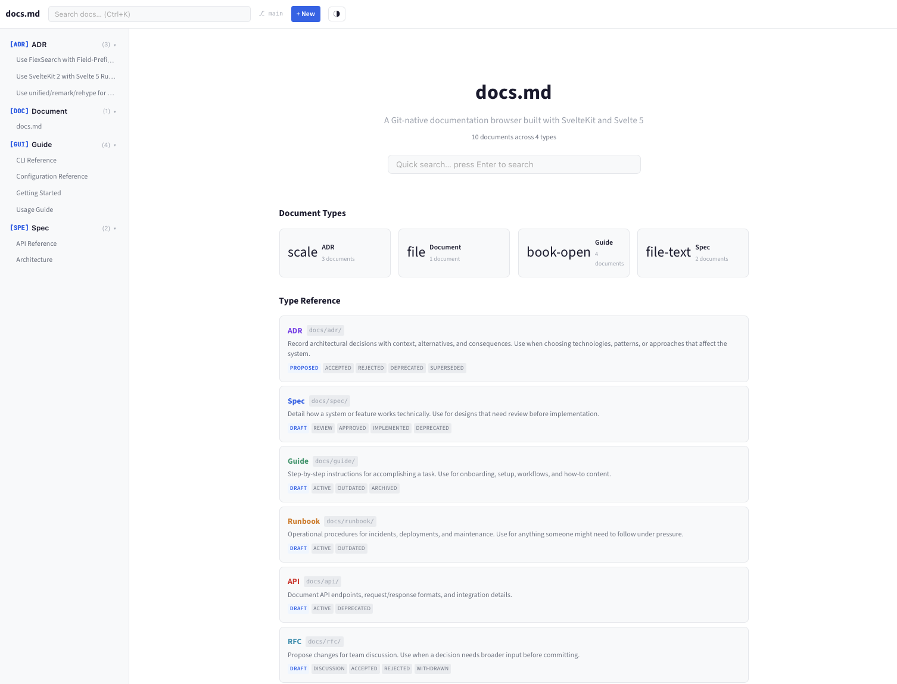
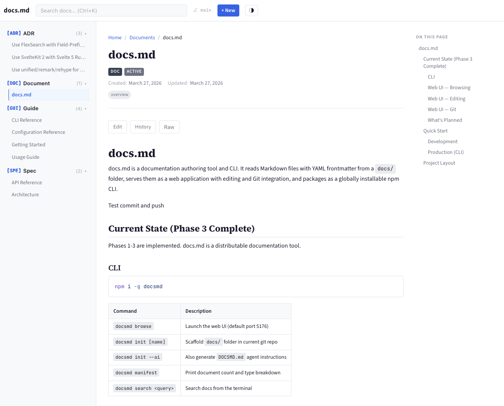
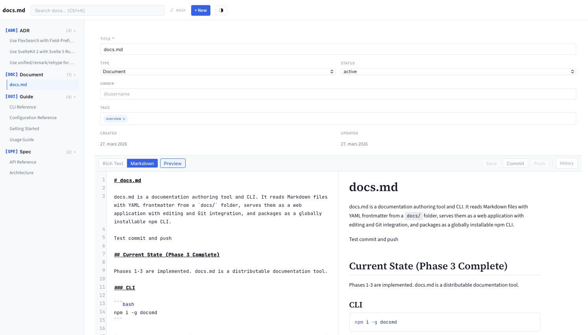
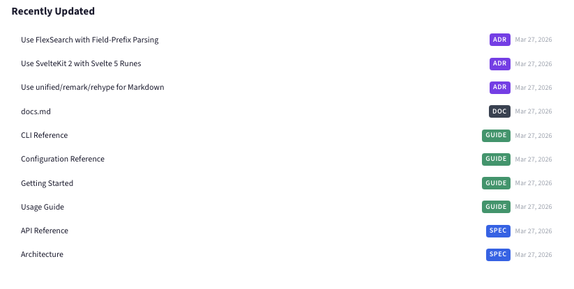
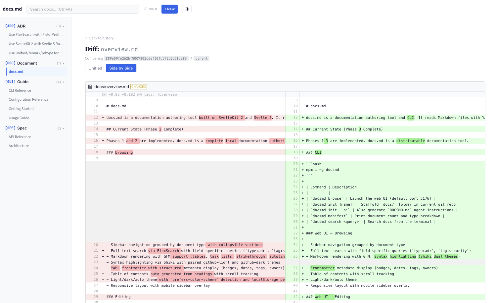
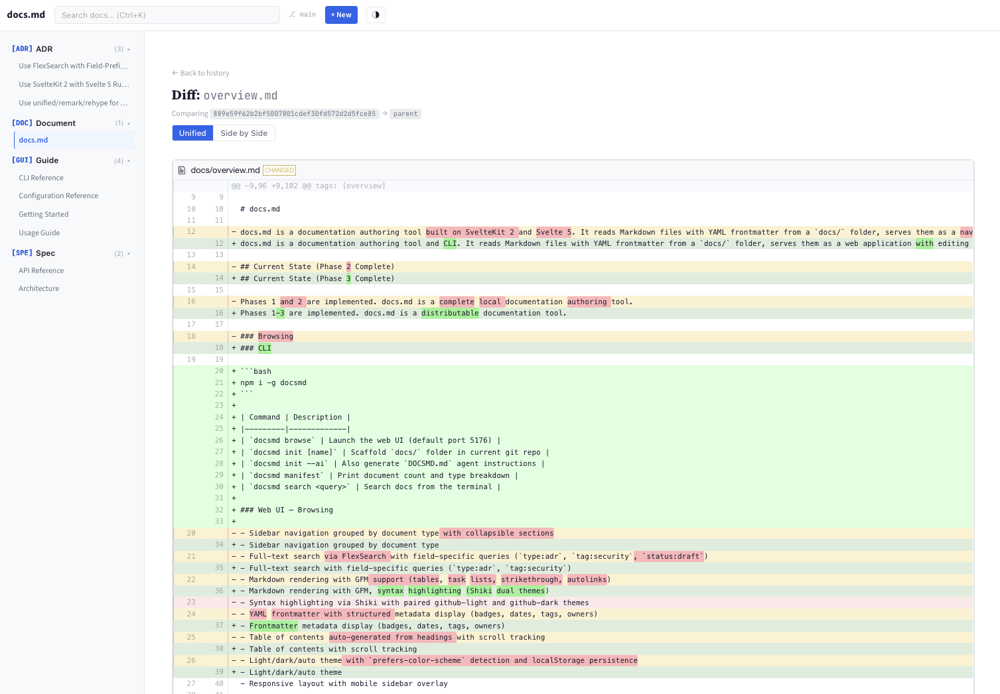

# docs.md

**A documentation system that lives in your Git repo.** Write ADRs, specs, guides, runbooks, and more as Markdown files with YAML frontmatter. Browse, edit, search, and manage them through a web UI or CLI.

No database. No hosting required. Just Markdown files and Git.



---

## Why docs.md?

Most project documentation ends up scattered across Notion, Confluence, Google Docs, and random wiki pages — disconnected from the code it describes.

docs.md keeps documentation **in your repo**, versioned with Git, editable by anyone who can write Markdown, and browsable through a proper UI.

- **Write** in a WYSIWYG editor or raw Markdown — your choice
- **Search** across all docs instantly, with field-specific queries like `type:adr` or `tag:security`
- **Track history** with Git diffs and commit timelines per document
- **Let AI agents** read and write documentation through a simple file convention and REST API
- **No vendor lock-in** — it's just `.md` files in a folder

---

## Quick Start

```bash
# Install globally
npm i -g @joachimhskeie/docsmd

# In any Git repository
docsmd init "My Project"
docsmd browse
```

That's it. Your browser opens with a fully functional documentation site.

---

## What You Get

### Structured Document Types

docs.md ships with 8 document types, each with its own lifecycle:

| Type | Purpose | Statuses |
|------|---------|----------|
| **ADR** | Architectural Decision Records | proposed, accepted, rejected, deprecated, superseded |
| **Spec** | Technical Specifications | draft, review, approved, implemented, deprecated |
| **Guide** | How-to Guides | draft, active, outdated, archived |
| **Runbook** | Operational Runbooks | draft, active, outdated |
| **API** | API Documentation | draft, active, deprecated |
| **RFC** | Requests for Comments | draft, discussion, accepted, rejected, withdrawn |
| **Meeting** | Meeting Notes | draft, final |
| **Doc** | General Documents | draft, active, archived |

Each type has a pre-filled template with section headings and writing guidance. Custom types can be added via `.docsmd.yml`.

### Browse Documents

Click any document in the sidebar to view it with rendered Markdown, syntax-highlighted code blocks, metadata badges, and a table of contents.



### Dual-Mode Editor

Edit in **Rich Text** (WYSIWYG powered by Milkdown) or **Markdown** (CodeMirror with syntax highlighting and live preview). Switch between modes without losing content. Save, commit, and push directly from the toolbar.

The structured frontmatter form handles metadata (title, type, status, owner, tags) without exposing raw YAML.



### Full-Text Search

Instant search across titles, body text, tags, headings, and owners. Use field prefixes for precise filtering:

```
type:adr                    # All ADRs
tag:security                # Docs tagged "security"
type:spec PostgreSQL        # Specs mentioning PostgreSQL
status:draft owner:alice    # Alice's drafts
```

Works in the web UI search bar (`Ctrl+K`) and from the terminal (`docsmd search`).

### Git Integration

Save, commit, and push from the editor toolbar. The header shows your branch, uncommitted changes, and commits ahead of remote. A global Push button appears when there are unpushed commits.

View the full commit history for any document:



Compare changes with unified or side-by-side diffs:





### AI Agent Ready

Run `docsmd init --ai` to generate a `DOCSMD.md` instruction file for AI coding agents. The web UI's landing page also has a copy-to-clipboard section with agent instructions.

AI agents can read, create, and update docs through:
- Direct filesystem access (they're just Markdown files)
- REST API (`GET/POST/PUT/DELETE /api/docs`, `GET /api/search`)

### Live File Watching

External changes to `.md` files (from your editor, AI agents, `git pull`, etc.) are detected automatically. The sidebar and search update on the next page load — no restart needed.

---

## CLI Commands

| Command | Description |
|---------|-------------|
| `docsmd browse` | Start web UI (default port 5176) |
| `docsmd init [name]` | Scaffold `docs/` folder with templates |
| `docsmd init --ai` | Also generate agent instruction file |
| `docsmd manifest` | Print document count and type breakdown |
| `docsmd search <query>` | Search from the terminal |

```bash
docsmd browse --port 8080 --no-open    # Custom port, no browser
docsmd search "auth" --type adr        # Search ADRs
docsmd search "deploy" --plain         # Machine-readable output
```

---

## Document Format

Every document is a Markdown file with YAML frontmatter:

```markdown
---
title: "Use PostgreSQL as Primary Database"
type: adr
status: accepted
owner: "@alice"
created: "2026-03-27"
updated: "2026-03-27"
tags: [database, infrastructure]
decision_date: "2026-03-15"
---

# Use PostgreSQL as Primary Database

## Context

We need a primary database for the platform...

## Decision

We will use PostgreSQL 16...

## Consequences

### Positive
- Strong ecosystem and tooling
- Excellent JSON support

### Negative
- More complex than SQLite for small deployments
```

Files live in `docs/{type}/{type}-{NNN}-{slug}.md`. The `title` field is required; everything else is optional.

---

## Project Structure

After running `docsmd init`, your repo looks like:

```
my-project/
  docs/
    .docsmd.yml              # Configuration
    overview.md              # Welcome page
    adr/                     # Architectural Decision Records
    spec/                    # Technical Specifications
    guide/                   # How-to Guides
    runbook/                 # Operational Runbooks
    api/                     # API Documentation
    rfc/                     # Requests for Comments
    meeting/                 # Meeting Notes
    _templates/              # Pre-filled templates
    _assets/                 # Uploaded images
```

---

## REST API

When the server is running, these endpoints are available:

| Method | Endpoint | Purpose |
|--------|----------|---------|
| `GET` | `/api/docs` | List documents (filterable by type, status, tag) |
| `POST` | `/api/docs` | Create document |
| `GET` | `/api/docs/{id}` | Read document |
| `PUT` | `/api/docs/{id}` | Update document |
| `DELETE` | `/api/docs/{id}` | Archive document |
| `GET` | `/api/search?q=...` | Full-text search |
| `GET` | `/api/git/status` | Git status |
| `GET` | `/api/git/history?path=...` | Commit history |
| `POST` | `/api/git/commit` | Commit changes |
| `POST` | `/api/git/push` | Push to remote |

---

## Tech Stack

- **SvelteKit 2** + **Svelte 5** (runes API)
- **Milkdown/Crepe** (WYSIWYG editor)
- **CodeMirror 6** (Markdown editor)
- **Shiki** (syntax highlighting)
- **FlexSearch** (full-text search)
- **simple-git** (Git operations)
- **diff2html** (diff rendering)
- **Commander.js** (CLI)

---

## Development

```bash
git clone https://github.com/joachimhs/docs-md.git
cd docs-md/specmd
npm install
DOCSMD_DOCS_DIR=docs npm run dev
```

```bash
npm test          # 72 tests
npm run check     # Type checking
npm run build     # Build web + CLI
```

---

## Requirements

- Node.js 20+
- Git

---

## License

MIT
